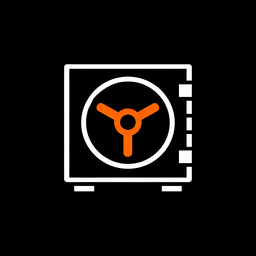

<p align="center">
  
</p>

<h1 align="center">SkillVault Desktop</h1>

<p align="center">
  <strong>The mod manager for AI coding skills</strong>
</p>

<p align="center">
  <a href="LICENSE"></a>
  
  
</p>

<br />

<!-- Screenshots coming soon -->

---

## Features

**Browse & Search the Marketplace**
Explore the full [SkillVault](https://skillvault.md) catalog — search by name, tool, category, or keyword without leaving the app.

**One-Click Install & Uninstall**
Install any skill to `~/.claude/` with a single click. Remove it just as easily.

**Choose Install Location**
Install skills globally or scope them to a specific project directory.

**Local Skill Scanner**
Automatically detects skills, agents, hooks, and plugins already on your machine by scanning `~/.claude/` and project directories.

**Browse 119 Official Plugins**
Explore the full catalog of official Claude Code plugins alongside community skills.

**Publish Your Skills**
Package and publish your own skills directly to the SkillVault marketplace from the app.

**Auto-Update Detection**
Get notified when installed skills have newer versions available on the marketplace.

**Live File Watcher**
Watches `~/.claude/` for changes and refreshes the UI in real time.

**Secure Auth via OS Keychain**
Your SkillVault token is stored in the macOS Keychain — never in plaintext config files.

**Dark Theme**
Matches the SkillVault web aesthetic — dark theme with Geist fonts and warm-toned grays.

---

## Quick Start

Download the latest `.dmg` from [Releases](https://github.com/boneio/skillvault-desktop/releases), or build from source:

```bash
git clone https://github.com/boneio/skillvault-desktop.git
cd skillvault-desktop
npm install
npm run tauri dev
```

### Prerequisites

| Requirement | Version |
|------------|---------|
| macOS | 10.15+ |
| Node.js | 18+ |
| Rust | 1.70+ |
| Cargo | (comes with Rust) |

Install Rust via [rustup](https://rustup.rs/) if you don't have it:

```bash
curl --proto '=https' --tlsv1.2 -sSf https://sh.rustup.rs | sh
```

---

## Development

```bash
npm run tauri dev                                       # Start dev mode with hot reload
cargo tauri build                                       # Build production .dmg
cargo test --manifest-path src-tauri/Cargo.toml         # Run Rust tests
```

---

## Architecture

SkillVault Desktop is built with **Tauri 2.0**, which pairs a Rust backend with a WebKit-based frontend window.

- **Rust backend** — Handles file scanning (`~/.claude/`), HTTP requests to the SkillVault API, zip extraction for skill packages, and secure token storage via the macOS Keychain.
- **TypeScript frontend** — Vanilla TypeScript compiled with Vite. No React, Vue, or Svelte. All UI is hand-written DOM manipulation with CSS matching the SkillVault web design system.
- **IPC bridge** — The frontend calls Rust functions through Tauri's typed command system. All heavy I/O stays in Rust; the frontend is purely presentational.

---

## Project Structure

```
skillvault-desktop/
├── src/                    # TypeScript frontend
│   ├── main.ts             # Entry point
│   ├── views/              # Installed, Browse, Trending, Detail, Settings
│   ├── components/         # Sidebar, package cards, toast notifications
│   ├── lib/                # API wrappers, state management, router, types
│   └── styles/             # CSS tokens, base styles, component styles
├── src-tauri/              # Rust backend
│   ├── src/
│   │   ├── scanner/        # Reads ~/.claude/ for skills, agents, hooks, plugins
│   │   ├── installer/      # Downloads + extracts packages from the API
│   │   ├── api/            # HTTP client for skillvault.md + keychain auth
│   │   ├── commands.rs     # Tauri IPC command handlers
│   │   └── state.rs        # App state + data types
│   ├── capabilities/       # Tauri permission declarations
│   ├── icons/              # App icons (all sizes)
│   └── tauri.conf.json     # Tauri configuration
├── docs/                   # PRD and planning documents
├── index.html              # WebKit entry point
├── vite.config.ts          # Vite build configuration
└── CLAUDE.md               # AI coding instructions
```

---

## Contributing

Contributions are welcome! See [CONTRIBUTING.md](CONTRIBUTING.md) for details.

The short version:

1. Fork the repo
2. Create a feature branch (`git checkout -b feat/my-feature`)
3. Make your changes
4. Run tests (`cargo test --manifest-path src-tauri/Cargo.toml`)
5. Submit a pull request

---

## Related Projects

- **[SkillVault](https://skillvault.md)** — The marketplace for AI coding skills
- **[Claude Code](https://claude.com/claude-code)** — Anthropic's AI coding tool

---

## License

[MIT](LICENSE) &copy; 2026 SkillVault
